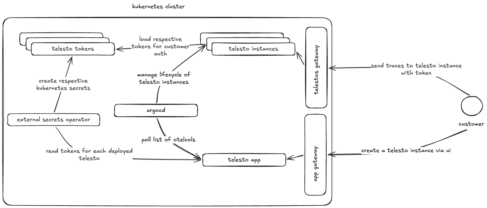

# Telesto

Telesto is an Opentelemetry Collector as a Service providing users an oppurtunity to test out cloud telemetry storage options without commiting time to their less than standardized instrumentation. 


## Architecture

Diagram:



### Components

#### Major Components

| Component Name  | Purpose  |
|---|---|
| ArgoCD  | Manage lifecycle of deployable telesto instances in Kubernetes created on telesto by users. |
| External Secrets Operator  |  Create Kuberenetes secrets with users' telesto tokens to be loaded by their respective telesto instance for secure ingestion of telemetry  | 
| Telesto  | Portal for users to manage their telesto instances and its respective components (tokens)  |


## Development


### Repo Structure

| Folder | Purpose |
|------|------|
| secrets | sops encrypted secrets for each kubernetes environment (local, dev, prod) deployed by tanka. You will find tanka.json in each environment folder |
| cmd | main entrypoint for each go binary. telesto-server and telestoctl (telestoctl is wip) |
| deploy | deployment scripts for creation of kubernetes clusters, deployment of kubernetes manifests through tanka with jsonnet |
| templates | templ templates files for rendering html from telesto server |
| static | static asset files for UI |
| internal | go packages for telesto-server and telestoctl

### Prerequisties

Dependencies for development and testing are managed by [mise](https://mise.jdx.dev/) in [mise.toml](mise.toml). Ensure mise is download to allow for a simple install with the following command.

```bash
mise install
```

### Local Development

To development locally or explore, you can create a local kind cluster to then deploy with tanka.

1. create kind cluster

```bash
make cluster-create
```

You will find a kubeconfig at in [deploy/cluster-local-telesto](./deploy/cluster-local-telesto). You can have them automatically injected in your shell with [direnv](https://direnv.net).

2. load vendor libraries

Before deploying to the cluster, we must load helm charts and jsonnet libraries used by tanka.

```bash
make vendor-charts
make install-tk-deps
```

3. start cloud-provider-kind

cloud-provider-kind supports implementation load balancers on your local machine for your kind cluster. This allows use not to use port forwarding/NodePorts. With that, we have hostctl to sync those loadbalancers ip created by cloud-provider-kind and domains to your local /etc/hosts file for ease of development. In order to have these two tools running at the same time, we are using goreman that disables sudo password input into subprocess  requiring entries into sudoers for cloud-provider-kind and hostctl.

Given the nature of these commands, please read them varefully and note the uninstall commands following the install commands below.

```bash
# install sudoers
make sudoers-install
# uninstall sudoers
make sudoers-uninstall
```

Now run the follow command in the background

```bash
make kind-lb
```

4. deploy telesto

The cluster and all the tools needed to deploy are ready. All services will be available un the telesto.test domain. Install the application in the cluster with the following command

```bash
make tk-apply tk-prune
```
